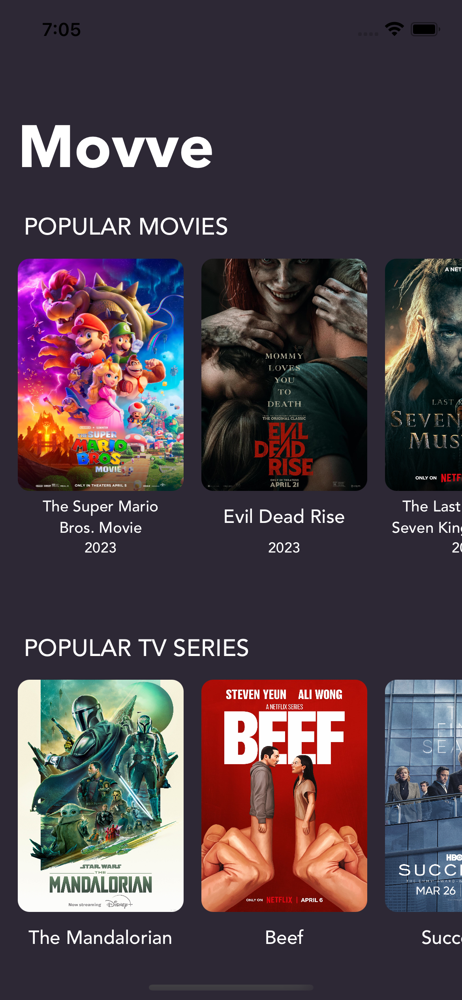

# MovviApp
---
Данное тестовые задание предлагает создать iOS приложение, показывающее популярные сегодня фильмы и сериалы с возможностью посмотреть подробности:
- описание
- длительность
- оценку
- актеров и т.п.

Требования к главному экрану:

- На главном экране нужно получить данные по популярным фильмам и сериалам, для них соответствующие запросы.

Требования к экрану фильма / сериала:

- Данные фильма, сериала и актеров брать из API.
- Кнопку “Watch Now” делать надо, но по нажатию пусть открывается страница фильма в браузере.
- Добавление закладок (избранное) пускай работает без всяких запросов и без сохранения в постоянном хранилище – достаточно запоминать выбор пользователя до тех пор, пока приложение не закроется.

Tech Stack: UIKit, MVVM, URLSession, Auto Layout, Cosmos, SwiftLint, SDWebImage, UserDefaults.

----

